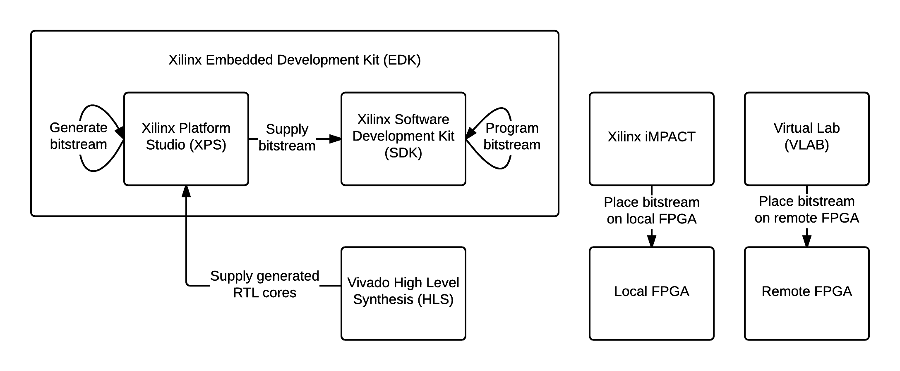

FPGA Implementation
===================

Tools Used
----------
The BoidCPU and BoidMaster FPGA cores were developed using the 2013.4 version Xilinx’s Vivado High Level Synthesis (HLS) Design Suite. These FPGA cores were then placed and routed using Xilinx Platform Studio (XPS) 14.7, part of the Xilinx Embedded Development Kit (EDK). Vendor-supplied cores included an Ethernet controller and MicroBlaze softcore processor. Xilnix Software Development Kit (SDK) 14.7 took the bitstream generated by XPS and programmed the Gatekeeper component on to the MicroBlaze. The final bitstream was placed on the FPGAs using Xilinx iMPACT 14.7. 

