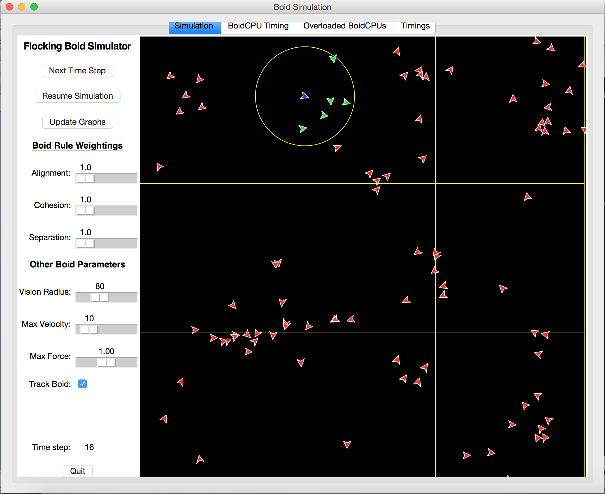
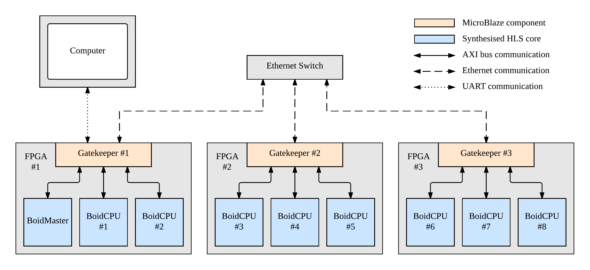
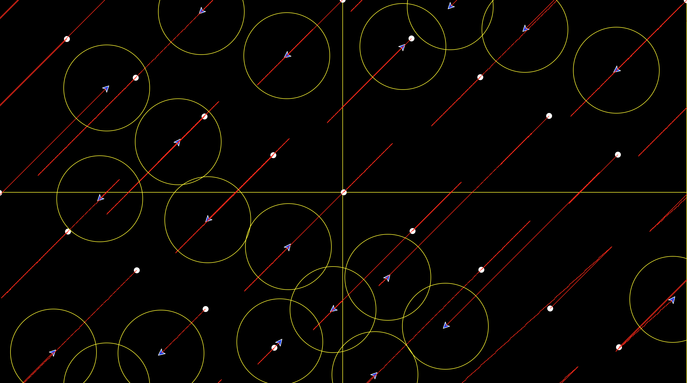
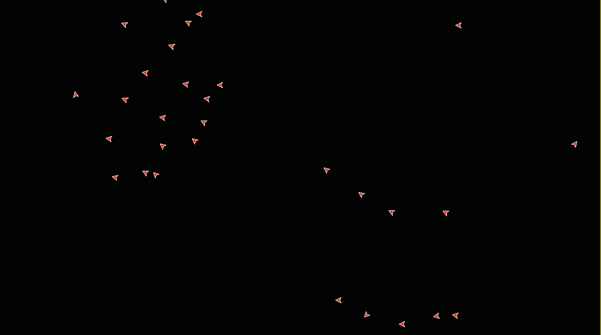

FPGA Implementation of Flocking Birds
=====================================

A scalable multi-FPGA implementation of flocking birds developed for a final year masters project. Consists of a Python simulator used to develop the system and the actual FPGA implementation.

Based on the *boids* model of flocking birds presented by [Craig Reynolds](http://www.red3d.com/cwr/boids/) and built on the scalability optimisations developed by [Andrews et al.](http://www-users.cs.york.ac.uk/susan/bib/ss/nonstd/alife08a.pdf) The simulation space is segemented into regions that are managed by *BoidCPU*s. As a boid moves around the regions it is transferred between BoidCPUs. Each BoidCPU is responsible for the updating and control of anny boids that lie within its bounds. The whole simulation is controlled using the BoidMaster. The gatekeeper component lies in the MicroBlaze processor of each FPGA and is responsibel for routing or dropping messages, as appropriate.

Python Simulator
----------------
A graphical application developed to investigate potential challenges in the final FPGA design. Capable of simulating different numbers of boids and BoidCPUs and plotting graphs to analyse their behaviour. Certain parameters can be changed on the fly, through the GUI and further parameters can be set in the code. Primarily used to develop an algorithm with suitable flocking behaviour, invetsigate load balancing approaches and different data type representations for the boid attributes.

FPGA Implementation
--------------------
The FPGA implementation of flocking birds built on the analysis performed using the Python simulation. It was developed for a Atlys Spartan 6 FPGA Development board using Xilinx EDK, SDK, iMPACT and Vivado HLS. Multiple BoidCPU cores were synthesised and placed on multiple FPGA boards with a single BoidMaster core in the system that controlled the simulation. The following image shows the setup of the system. 

Due to the resource constraints imposed by embedded systems development some of the boid logic had to be removed to ensure that two BoidCPUs could fit on a single FPGA board. The following image shows the traces of 20 boids over 4 BoidCPUs across 2 FPGAs. These images were produced by supplying the graphics components from the Python simulator with the textual output from the FPGA simulation.

Restoring the full boid logic meant that only a single BoidCPU could fit on a single FPGA board. The following image shows how using the full boid logic model lead to realistic flocking behaviour for 30 boids across 1 BoidCPU and 1 FPGA. 

Further Work
------------
The FPGA implementations presented here, predominantly the multi-FPGA implementation currently have a number of issues preventing them from performing for a significant amount of time. Future work should look at addressing these issues before extending the system with, for example, decentralised load balancing and additional boid behaviours. 

